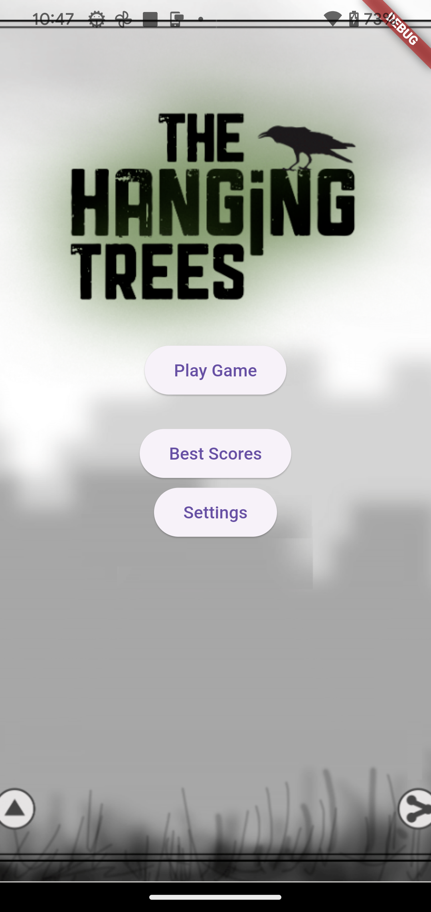
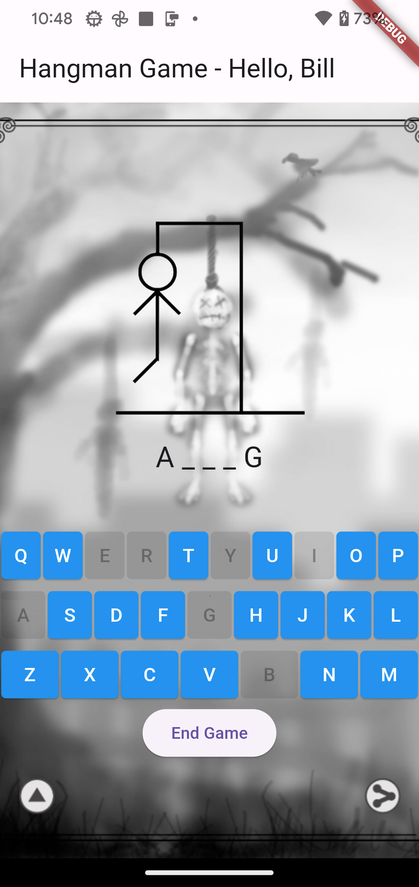
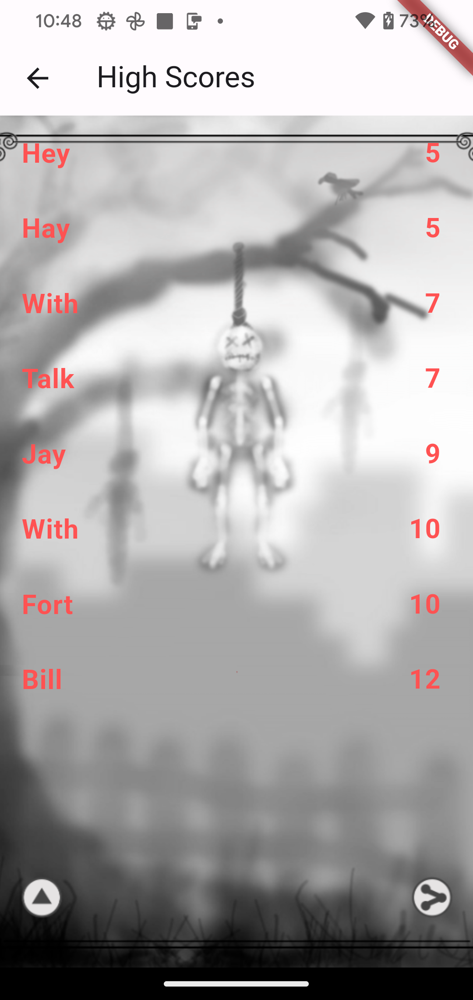
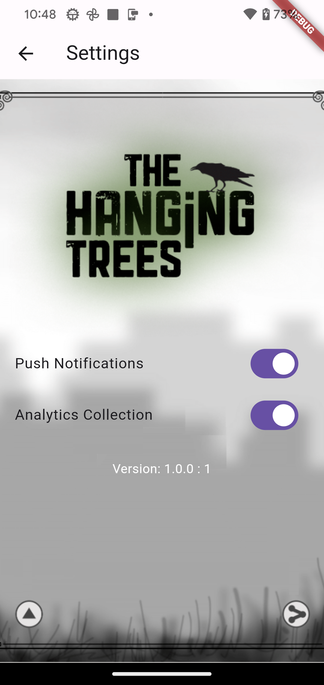

# hangman

A new Flutter project.

## Getting Started

This project is a starting point for a Flutter application.

A few resources to get you started if this is your first Flutter project:

- [Lab: Write your first Flutter app](https://docs.flutter.dev/get-started/codelab)
- [Cookbook: Useful Flutter samples](https://docs.flutter.dev/cookbook)

For help getting started with Flutter development, view the
[online documentation](https://docs.flutter.dev/), which offers tutorials,
samples, guidance on mobile development, and a full API reference.

## ChatGPT 4.0 Flutter Hangman
[ChatGPT](https://chat.openai.com/)

### Prompts
- can you write me a hangman game in flutter
- can you add 1000 possible words
- can you put the wordlist in a local datastore and add 1000 words to it
- show me how to do this with sqflite
- can we ask the player for their name before the game starts
- Their name shouldn't be allowed to be null or contain only whitespace
- Now that we know the user's name, can we keep track of their best score based on the fewest number of guesses
- show me all the code we have so far
- can we encrypt the wordlist so people can't cheat
- can we separate the database calls into an interface to more easily change the underlying storage solution in the future
- show a "Winner!" message when the user gets the word right
- when the winner message is shown, update the highscore if appropriate
- When the game is won, show a Play Again button that restarts the game
- Add an end game button
- draw a keyboard on the screen and use that for letter guesses instead of the text entry field
- Setup the keyboard in a qwerty configuration
- the keyboard rows are too long for the screen
- make the keyboard fit, it's still too wide
- fyi, 'primary' should be 'foregroundColor' and 'onPrimary' should be 'backgroundColor'
- don't use wrap because that messes up the keyboard
- reduce the padding on the keyboard
- shrink the keyboard more, it's still overflowing the right edge
- {At this point I simply captured a screenshot of the app running with the messed up keyboard and uploaded it. It recognized the issue and fixed it. I sh*t you not.}
- Can we restrict the name entry to only letters and start the keyboard with capital letters?
- can we draw a hangman on the screen as the user guesses incorrectly and lose the game if the full hangman is drawn?
- can you make the hangman images for me please
- can you generate a list of 1000 words for my game
- I need them in a format that i can put into my code to insert them into my database
- {at this point I copied and pasted all the code we have so far as I have fixed some lint warnings as we went} Note: it learned from those changes and often offered them in the solutions going forward.
- Can we add a background image to my screen?
- Make me a highscores screen that shows the top 10 scores and add a button to the home screen to view it
- {replying to a specific output about `getDatabase()`} I don't have this
- {uploaded a screenshot of a `NoSuchMethodError` for the High Scores screen}
- add the same background to my highscores screen
- make the text on my highscores screen a little larger, bold, and light red
- Add a splash screen to display first that has a background image named splash.png, put 'Play Game' and 'Best Scores' buttons on the screen. Make the play game button launch the game and make the best scores button show the high scores screen.
- Make the end game button return to the splash screen
- Add a settings screen with a button to access it on the splash screen. The settings screen should have a background image, the same as the splash screen, it should have two toggle switches, 1 for toggling Push Notifications and 1 for toggling Analytics Collection. It should also show the application version number centered at the bottom of the screen.
- In dart, how do I return the value of a string if it is not null or a default value in a single line of code?
- the settings screen should have an app bar just like the highscores screen
- The push and analytics toggles should be closer to each other in the middle-ish of the screen
- can we move only the version number info toward the bottom of the screen
- give me a thorough .gitignore file for a flutter project that includes both android and ios applications

### And here we are! Initial commit.

